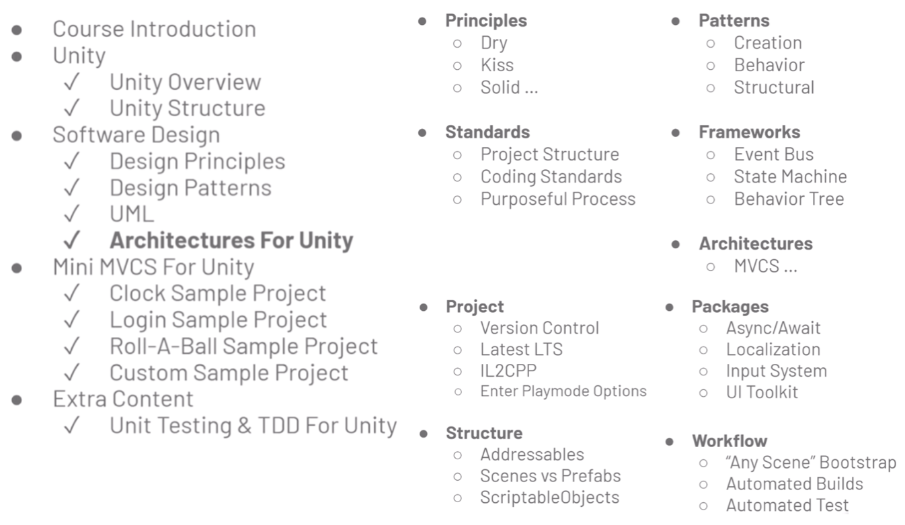

# MVC MVP MVVM

<!-- TOC -->
* [MVC MVP MVVM](#mvc-mvp-mvvm)
  * [MVP](#mvp)
  * [MVCS (Model-View-Controller-Service)](#mvcs-model-view-controller-service)
  * [MVVM](#mvvm)
<!-- TOC -->

## MVP

- [6-unity-ui-toolkits.md](../1-unity-basics/6-unity-ui-toolkits.md)
- [YouTube - Level up your code with game programming patterns: Model-view-presenter | Tutorial](https://www.youtube.com/watch?v=agoe5BdLzdk&list=PLX2vGYjWbI0TmDVbWNA56NbKKUgyUAQ9i&index=4) 
  - [Ebook - Level up your code with game programming patterns](https://unity.com/resources/level-up-your-code-with-game-programming-patterns)
- [Build a modular codebase with MVC and MVP programming patterns](https://unity.com/how-to/build-modular-codebase-mvc-and-mvp-programming-patterns)
- [Level up your code with design patterns and SOLID](https://assetstore.unity.com/packages/essentials/tutorial-projects/level-up-your-code-with-design-patterns-and-solid-289616#content)
- [從Clean Architecture 的角度來看看MVP與MVVM](https://hung-yanbin.medium.com/從clean-architecture-的角度來看看mvp與mvvm-84b4883b0dde)
- [UnitySimpleCleanArchitecturePlane](https://github.com/genki-tx/UnitySimpleCleanArchitecturePlane)

## MVCS (Model-View-Controller-Service)

- [rmc-mini-mvcs](https://github.com/androchentw/rmc-mini-mvcs/tree/andro/docs): MVCS architecture example and design
  patterns explained
  - 
  - 
- [unity-best-practices](https://github.com/androchentw/unity-best-practices/tree/andro)
- Tips
  - Project Settings > Editor >Enter Play Mode Options = True
  - "Any Scene" Bootstrap: developer mode / testing

Credit: [Samuel Asher Rivello. Best Practices - 4 - Unity Case Study](https://www.youtube.com/watch?v=Y5uaw4mYR_E&list=PL5domiITryHiP04FA13aCM9pl4S_c9XOi&index=6)

## MVVM

- [Unity App UI](https://docs.unity3d.com/Packages/com.unity.dt.app-ui@2.0/manual/index.html)
- [MVVM — 架構篇：書讀得多，人自然就好看起來](https://medium.com/ken-do-everything/mvvm-架構篇-書讀得多-人自然就好看起來-4fd595581e7f)
  - Ref Android Jetpack: ViewModel, LiveData, Room, DataBinding
- [MVC、MVP、MVVM 解析【理论篇】](https://aihailan.com/archives/100)
- [Unity开发 浅谈MVC、MVP、MVVM的特点、运用与区别](https://blog.csdn.net/qq_43505432/article/details/111154779)
- [Unity中的MVC、MVP、MVVM框架](https://blog.csdn.net/qq_54476817/article/details/132513548)
- [Game-Programming-Patterns-Demo](https://github.com/Unity-Technologies/game-programming-patterns-demo/tree/main/Assets/UnityTechnologies/_DesignPatterns/7_MVVM)
- [loxodon-framework](https://github.com/vovgou/loxodon-framework)
- [UnityMvvmToolkit](https://github.com/LibraStack/UnityMvvmToolkit)
- [Introduction to the MVVM Pattern](https://docs.unity3d.com/Packages/com.unity.dt.app-ui@2.0/manual/mvvm-intro.html)
