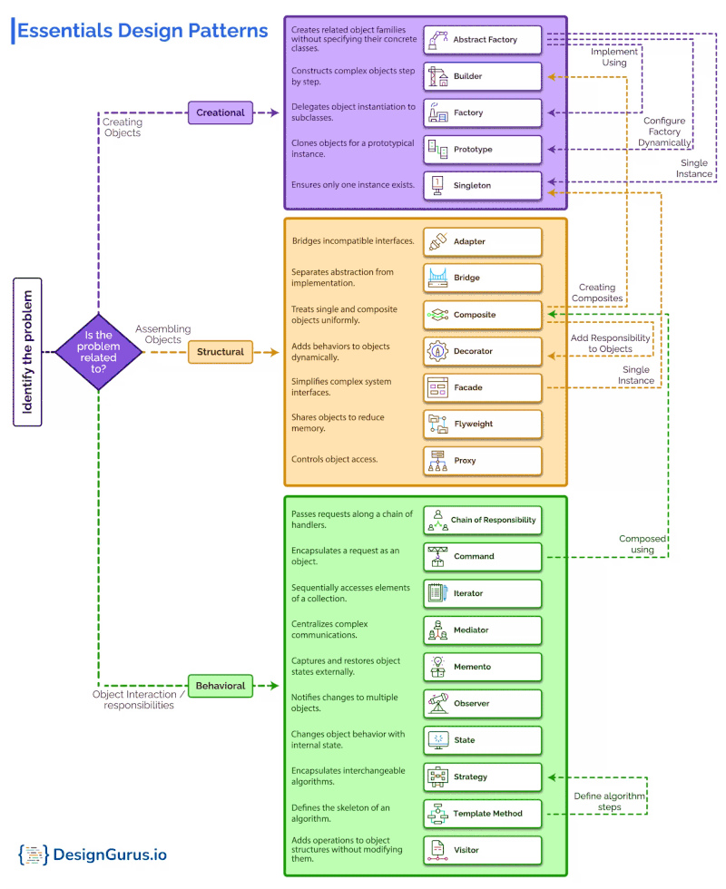

# Design Patterns

<!-- TOC -->
* [Design Patterns](#design-patterns)
  * [C# Code Examples](#c-code-examples)
  * [Tutorials](#tutorials)
    * [Creational: Creation](#creational-creation)
    * [Structural: Relationships](#structural-relationships)
    * [Behavioral: Communication](#behavioral-communication)
  * [Unity 6 Practices](#unity-6-practices)
<!-- TOC -->



```text
│   ├── design-patterns-cs/
│   │   ├── behavioral-chain-of-responsibility.cs
│   │   ├── behavioral-command.cs
│   │   ├── behavioral-iterator.cs
│   │   ├── behavioral-mediator.cs
│   │   ├── behavioral-memento.cs
│   │   ├── behavioral-observer.cs
│   │   ├── behavioral-state.cs
│   │   ├── behavioral-strategy.cs
│   │   ├── behavioral-template-method.cs
│   │   ├── behavioral-visitor.cs
│   │   ├── creational-abstract-factory.cs
│   │   ├── creational-builder.cs
│   │   ├── creational-factory.cs
│   │   ├── creational-prototype.cs
│   │   ├── creational-service-locator.cs
│   │   ├── creational-singleton.cs
│   │   ├── structural-adapter.cs
│   │   ├── structural-bridge.cs
│   │   ├── structural-composite.cs
│   │   ├── structural-decorator.cs
│   │   ├── structural-facade.cs
│   │   ├── structural-flyweight.cs
│   │   └── structural-proxy.cs
│   ├── README-unity-6-practices.md
│   ├── Tutorial-Lessons.md
│   ├── Tutorial-Samples-Basic.md
│   ├── Tutorial-Samples-More.md
```

## C# Code Examples

- [design-patterns](design-patterns-cs/README.md)

## Tutorials

- [C# Design Patterns](https://www.dofactory.com/net/design-patterns)
- [Design Pattern in C# explained by ChatGPT | 2024-10-26](https://chatgpt.com/share/671c90d8-7664-800f-b67e-8bec77698012)
- [game-programming-patterns-demo](https://github.com/androchentw/game-programming-patterns-demo)
- [Game Programming Patterns](https://gameprogrammingpatterns.com/contents.html)

### Creational: Creation

| **分類**       | **設計模式**                           | **目的/結果對比**                                                                                                                   |
|--------------|------------------------------------|-------------------------------------------------------------------------------------------------------------------------------|
| **對象創建與組合**  | Abstract Factory, Factory, Builder | - **Abstract Factory**：提供一組相關對象的創建接口，無需指定具體類別 <br> - **Factory**：用於創建對象的工廠方法，根據需求返回不同子類對象 <br> - **Builder**：按步驟創建複雜對象，允許靈活組合 |
| **對象複製**     | Prototype                          | - **Prototype**：通過複製現有實例來創建新對象，避免直接初始化                                                                                        |
| **唯一性與全局訪問** | Singleton                          | - **Singleton**：確保一個類別只有一個實例，並提供全局訪問點                                                                                         |
| **對象查找與管理**  | Service Locator                    | - **Service Locator**：提供全局的對象訪問和管理機制，用於動態查找和注入                                                                                |

### Structural: Relationships

| **分類**      | **設計模式**        | **目的/結果對比**                                                       |
|-------------|-----------------|-------------------------------------------------------------------|
| **接口適配與兼容** | Adapter, Bridge | - **Adapter**：將現有接口轉換為另一接口以適應需求 <br>  - **Bridge**：將抽象與實現分離以便獨立變化 |
| **結構與組合**   | Composite       | - **Composite**：建立樹狀結構以表示部分-整體的層次結構                               |
| **行為擴展與裝飾** | Decorator       | - **Decorator**：動態地為對象添加職責或行為，不改變其結構                              |
| **簡化與封裝**   | Facade          | - **Facade**：為複雜系統提供簡化的接口，隱藏內部實現細節                                |
| **資源共享與優化** | Flyweight       | - **Flyweight**：共享內部狀態以減少相似對象的內存消耗                                |
| **訪問控制與代理** | Proxy           | - **Proxy**：為另一對象提供控制訪問的替身，並可延遲加載或權限控制                            |

### Behavioral: Communication

| **分類**       | **設計模式**                         | **目的/結果對比**                                                                         |
|--------------|----------------------------------|-------------------------------------------------------------------------------------|
| **流程控制與決策**  | Chain of Responsibility, Command | - **Chain of Responsibility**：傳遞請求至責任鏈中的合適處理者 <br> - **Command**：封裝請求作為對象以支持撤銷和操作隊列 |
| **行為交換與管理**  | State, Strategy                  | - **State**：根據狀態轉換來改變行為 <br> - **Strategy**：根據不同策略執行不同行為                            |
| **對象訪問與操作**  | Iterator, Visitor                | - **Iterator**：順序訪問集合中的元素 <br> - **Visitor**：為對象結構添加新操作，不改變結構                       |
| **協調與通知**    | Mediator, Observer               | - **Mediator**：集中管理對象間的通信 <br> - **Observer**：當狀態改變時通知依賴對象                          |
| **模板與規範化操作** | Template Method                  | - **Template Method**：定義算法骨架，讓子類覆蓋特定步驟                                              |
| **保存與回溯**    | Memento                          | - **Memento**：保存對象狀態，以便在需要時回溯                                                       |

## Unity 6 Practices

* [Level up your code with design patterns and SOLID](https://assetstore.unity.com/packages/essentials/tutorial-projects/level-up-your-code-with-design-patterns-and-solid-289616)
  * [🥇 game-programming-patterns-demo](https://github.com/androchentw/game-programming-patterns-demo)
  * [E-book update: Level up your code with design patterns and SOLID](https://unity.com/resources/design-patterns-solid-ebook?isGated=alse)
  * [Create modular and maintainable code with the Observer pattern](https://unity.com/how-to/create-modular-and-maintainable-code-observer-pattern)
  * [Develop a modular, flexible codebase with the State programming pattern](https://unity.com/how-to/develop-modular-flexible-codebase-state-programming-pattern)
  * [Use object pooling to boost performance of C# scripts in Unity](https://unity.com/how-to/use-object-pooling-boost-performance-c-scripts-unity)
  * [Build a modular codebase with MVC and MVP programming patterns](https://unity.com/how-to/build-modular-codebase-mvc-and-mvp-programming-patterns)
  * [How to use the factory pattern for object creation at runtime](https://unity.com/how-to/how-use-factory-pattern-object-creation-runtime)
  * [Use the command pattern for flexible and extensible game systems](https://unity.com/how-to/use-command-pattern-flexible-and-extensible-game-systems)
* [Best practices for project organization and version control (Unity 6 edition)](https://unity.com/resources/best-practices-version-control-unity-6)
* [Optimize your game performance for mobile, XR, and the web in Unity (Unity 6 edition)](https://unity.com/resources/mobile-xr-web-game-performance-optimization-unity-6)
