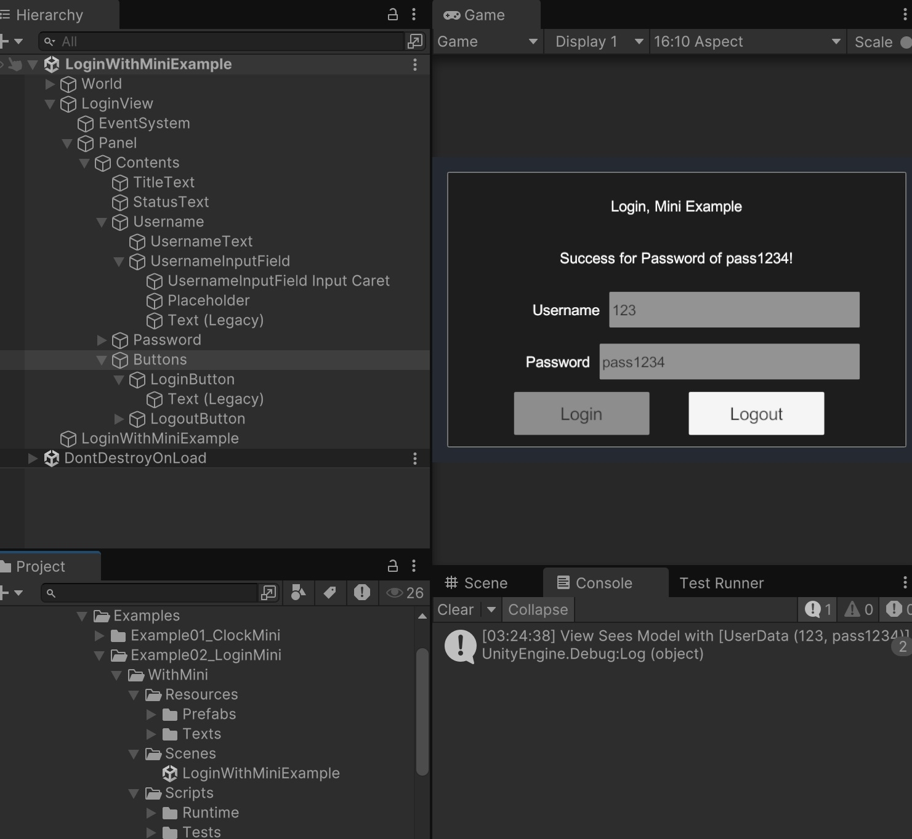

# RMC Tutorial - Samples Example: Basic

<!-- TOC -->
* [RMC Tutorial - Samples Example: Basic](#rmc-tutorial---samples-example-basic)
  * [Example 1 ClockMini](#example-1-clockmini)
    * [MVCS](#mvcs)
    * [General Function](#general-function)
    * [Test](#test)
    * [Ref](#ref)
  * [Example 2 LoginMini](#example-2-loginmini)
    * [MVCS](#mvcs-1)
    * [General Function](#general-function-1)
    * [Test](#test-1)
    * [Ref](#ref-1)
  * [Example 3 RollABall](#example-3-rollaball)
    * [MVCS](#mvcs-2)
    * [General Function](#general-function-2)
    * [Test](#test-2)
    * [Ref](#ref-2)
<!-- TOC -->

* [Path](https://github.com/androchentw/rmc-mini-mvcs/tree/andro): `RMC Mini MVCS/Samples~/RMC Mini MVCS - 1. Beginner Examples/Examples`
* [RMC Tutorial - Samples Example: Basic](#rmc-tutorial---samples-example-basic)
  * [Example 1 ClockMini](#example-1-clockmini)
    * [MVCS](#mvcs)
    * [General Function](#general-function)
    * [Test](#test)
    * [Ref](#ref)
  * [Example 2 LoginMini](#example-2-loginmini)
    * [MVCS](#mvcs-1)
    * [General Function](#general-function-1)
    * [Test](#test-1)
    * [Ref](#ref-1)
  * [Example 3 RollABall](#example-3-rollaball)
    * [MVCS](#mvcs-2)
    * [General Function](#general-function-2)
    * [Test](#test-2)
    * [Ref](#ref-2)

## Example 1 ClockMini

### MVCS

* ClockWithMiniExample > clockSimpleMini.Initialize()
* public class ClockSimpleMini: SimpleMiniMvcs
  <Context,
    ClockModel,
    ClockView,
    ClockController,
    ClockService>
    Initialize()
* ClockModel: BaseModel
  * Observable. Observable Pattern
* ClockService : BaseService
  * LoadedUnityEvent : UnityEvent
  * async Task LoadAsync
    * OnLoaded.Invoke();
  * TextAsset textAsset = `Resources.Load<TextAsset>("Texts/ClockWithMiniText");` //讀取 Resources folder 實體檔案
* ClockController: BaseController
  * Unity Stopwatch
  * Bind M V S
  * on Event Handlers
  * C# CommandManager. Command pattern
* ClockHelper
  * async await
  * C# TaskCompletionSource
  * await fun.Invoke();

### General Function

* Debug.Log($"message"): Unity > Console
* Application.isPlaying

### Test

* Editor (Unity Test)
  * ControllerTest: Controller_InvokesTimeChangedCommand_WhenModelTimeChanges
  * ClockModelTest: ClockModelTest_DefaultValues_WhenCreated
* Runtime (Integration Test)
  * ClockModelPlayModeTest
  * ClockServicePlayModeTest
  * ClockViewPlayModeTest
* MockClockMini

### Ref

* ScriptableObject
  * [【阿空】Unity的可編程物件：ScriptableObject！ ( ScriptableObject in Unity!)](https://www.youtube.com/watch?v=0nW5PhQTWbQ)
  * [Unity手札 初探ScriptableObject](https://chrislin1015.medium.com/unity%E6%89%8B%E6%9C%AD-%E5%88%9D%E6%8E%A2scriptableobject-3827b6f30740)
  * [Unity — uEvent & ScriptableObjects](https://samuel-asher-rivello.medium.com/unity-ueventdispatcher-scriptableobjects-d1e6038b8345)
  * [ScriptableObject（可编程对象）为团队和代码带来的六个好处](https://unity.com/cn/blog/engine-platform/6-ways-scriptableobjects-can-benefit-your-team-and-your-code)
* Observable Pattern
  * [UnityObservables](https://github.com/Adam4lexander/UnityObservables)
  * [如何在 Unity 裡寫出具有一定擴充性的遊戲(17) — Observer模式(一)](https://medium.com/@ShailaRuza70245/%E5%A6%82%E4%BD%95%E5%9C%A8-unity-%E8%A3%A1%E5%AF%AB%E5%87%BA%E5%85%B7%E6%9C%89%E4%B8%80%E5%AE%9A%E6%93%B4%E5%85%85%E6%80%A7%E7%9A%84%E9%81%8A%E6%88%B2-17-observer%E6%A8%A1%E5%BC%8F-%E4%B8%80-9c5077f298e5)
* Command Pattern

## Example 2 LoginMini

### MVCS

* LoginWithMiniExample > LoginMini: SimpleMiniMvcs
* LoginModel: BaseModel. Observable
  * UserData: DTO
* LoginView: MonoBehaviour, IView
* LoginService: BaseService
  * async void LoginAsync(UserData)
  * OnLoginCompletedUnityEvent : UnityEvent<UserData, bool>
* Controller
  * LoginController: BaseController. M V C
  * Commands
    * LoggedInUserDataChangedCommand : `ValueChangedCommand<UserData>`
    * LoginCompletedCommand : ICommand. UserData
    * LoginSubmittedCommand : ICommand. UserData, WasSuccess
    * LogoutCommand : ICommand

### General Function

* ContextWithLocator: Service Locator Pattern

### Test

* Editor
  * LoginControllerTest: Controller_InvokesTimeChangedCommand_WhenModelTimeChanges
  * LoginModelTest
* Runtime
  * LoginServicePlayModeTest
    * UserDataOutput_IsSameAsInput_WhenLoginCompleted
    * WasSuccess_IsFalse_WhenIncorrectPassword
    * WasSuccess_IsTrue_WhenCorrectPassword
  * LoginViewPlayModeTest
    * Initialize_DoesNotThrow_WhenCalled

### Ref

* DTO
  * [DAO, DTO 啥鬼？還有 GTO 嗎](https://justinhollly.medium.com/dao-dto-%E5%95%A5%E9%AC%BC-%E9%82%84%E6%9C%89-gto-%E5%97%8E-39a42f13768b)
  * [DTO、VO、BO、DAO、POJO 各種 Object](https://hackmd.io/@OceanChiu/HJBvCZcQ8)
* Service Locator
  * [C#/Unity 這不叫 Singleton，叫 Service Locator](https://www.douduck08.com/zh-tw/practicing-of-service-locator/)
  * [Design Patterns for Unity Developers: Service Locator](https://medium.com/@taha.m.gokdemir/design-patterns-for-unity-developers-service-locator-124cd4628c43)

## Example 3 RollABall

### MVCS

### General Function

### Test

### Ref
