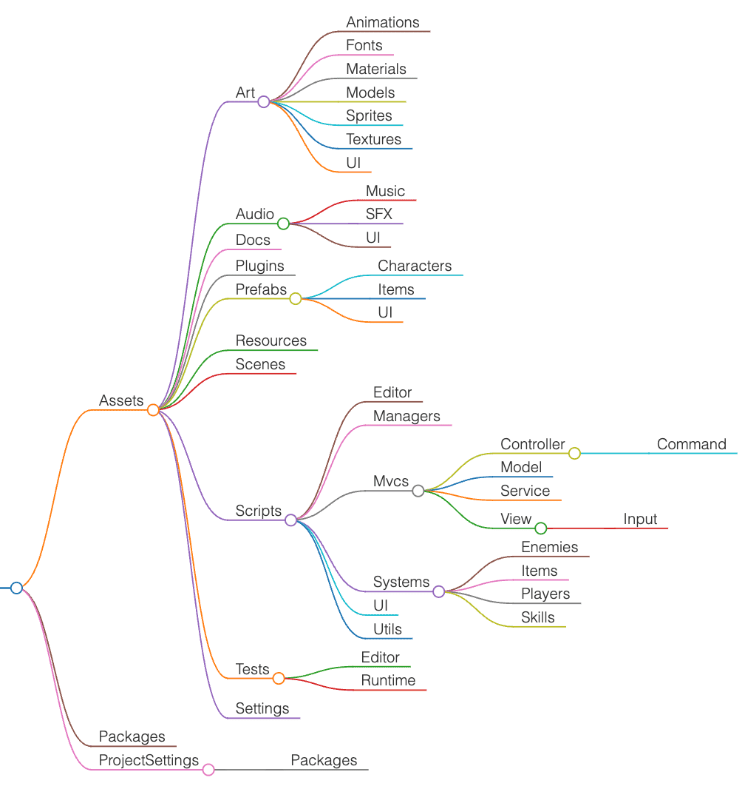
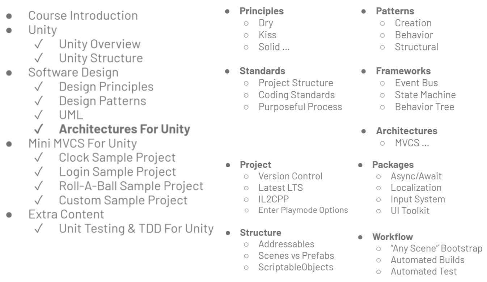
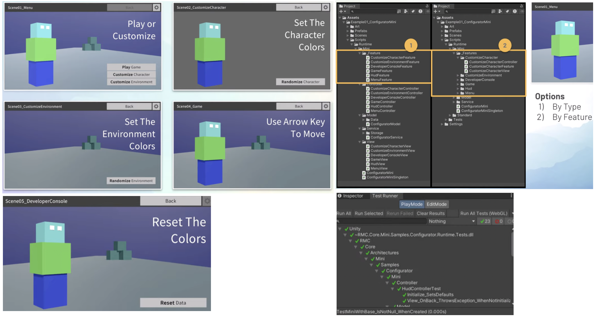

# Unity Folder Structure

<!-- TOC -->
* [Unity Folder Structure](#unity-folder-structure)
  * [Project Structure Template](#project-structure-template)
  * [Sample Project Structure](#sample-project-structure)
  * [Reference Structure - unity-project-template](#reference-structure---unity-project-template)
  * [Asset Type](#asset-type)
  * [MVCS (Model-View-Controller-Service)](#mvcs-model-view-controller-service)
  * [MVVM](#mvvm)
  * [DDD](#ddd)
<!-- TOC -->

Ref

- [4-unity-best-practices.md](4-unity-best-practices.md)
- [5-unity-custom-package.md](5-unity-custom-package.md)
- [6-unity-ui-toolkits.md](6-unity-ui-toolkits.md)

## Project Structure Template

- Best practices for organizing your Unity project
- [unity-project-template](https://github.com/androchentw/unity-project-template/tree/andro): clean project structure and C# coding standards template
- [unity-project-style-guide](https://github.com/timdhoffmann/unity-project-style-guide)
- [Package layout](https://docs.unity3d.com/Manual/cus-layout.html)
- [Adding tests to a package](https://docs.unity3d.com/Manual/cus-tests.html)
- [How to run automated tests for your games with the Unity Test Framework](https://unity.com/how-to/automated-tests-unity-test-framework)

## Sample Project Structure

- [UnityBaseTemplate2DURP](https://github.com/androchentw/UnityBaseTemplate2DURP)
- [Sample Game Projects on Unity Asset Store](../2-unity-assets-collection/unity-assets-templates.md)



- Assets
  - Art
    - Animations
    - Fonts
    - Materials
    - Models
    - Sprites
    - Textures
    - UI
  - Audio
    - Music
    - SFX
    - UI
  - Docs
  - Plugins
  - Prefabs
    - Characters
    - Items
    - UI
  - Resources
  - Scenes
  - Scripts
    - Editor
    - Managers
    - Mvcs (Core)
      - Controller
        - Command
      - Model
      - Service
      - View
        - Input
    - Systems
      - Enemies
      - Items
      - Players
      - Skills
    - UI
    - Utils
  - Tests
    - Editor
    - Runtime
  - Settings
- Packages
- ProjectSettings
  - Packages

## Reference Structure - unity-project-template

Note: ignored `*.meta`, `*.asset`

```text
UnityProject/
├── Assets/
    ├── 3rdParty/
        ├── [CompanyName]/
            ├── [PackageName]/
                ├── Version.txt
    ├── Art/
        ├── Animation/
            ├── AnimationClips/
            ├── Animators/
        ├── Audio/
            ├── AudioClips/
            ├── AudioMixers/
        ├── Fonts/
            ├── Arial.ttf
        ├── Materials/
            ├── FloorMaterial.mat
            ├── PlayerMaterial.mat
        ├── Models/
        ├── Shaders/
        ├── Sprites/
        ├── Textures/
            ├── FloorTexture.png
    ├── Documentation/
        ├── Images/
            ├── BestPractices.png
        ├── ReadMe/
            ├── Art/
                ├── Sprites/
                    ├── ProjectIcon.png
            ├── Scripts/
                ├── Editor/
                    ├── ReadMeMenuItems.cs
    ├── Prefabs/
        ├── [MyCompany]/
            ├── [MyProject]/
                ├── AudioManager.prefab
    ├── Resources/
        ├── [MyCompany]/
            ├── [MyProject]/
    ├── Scenes/
        ├── Scene01_Intro.unity
    ├── Scripts/
        ├── Editor/
            ├── [MyCompany]/
                ├── Templates/
                    ├── TemplateEditorMenuItems.cs
                ├── [MyProject]/
        ├── Runtime/
            ├── [MyCompany]/
                ├── Templates/
                    ├── ITemplateInterface.cs
                    ├── TemplateClass.cs
                    ├── TemplateComponent.cs
                    ├── TemplateScriptableObject.cs
                ├── [MyProject]/
                    ├── Scenes/
                        ├── Scene01_Intro.cs
                    ├── UI/
                        ├── HudUI.cs
        ├── Tests/
            ├── Editor/
                ├── [MyCompany]/
                    ├── Templates/
                        ├── TemplateClassEditModeTest.cs
                    ├── [MyProject]/
            ├── Runtime/
                ├── [MyCompany]/
                    ├── Templates/
                        ├── TemplateComponentPlayModeTest.cs
                    ├── [MyProject]/
    ├── Settings/
        ├── Audio/
        ├── InputSystem/
        ├── PhysicMaterials/
        ├── Presets/
        ├── ProBuilder/
        ├── Rendering/
        ├── UIToolkit/
            ├── Layouts/
                ├── TemplateLayout.uxml
            ├── Resources/
            ├── Settings/
            ├── Styles/
                ├── TemplateStyles.uss
            ├── Themes/
                ├── TemplateThemeStyleSheet.tss
├── Packages/
    ├── manifest.json
    └── packages-lock.json
├── ProjectSettings/
```

## Asset Type

- [Unity项目中Assets目录下常见的文件类型](https://blog.csdn.net/c373756607/article/details/86601926)
- [浅谈Assets——Unity资源映射](https://blog.csdn.net/UWA4D/article/details/104060885)
- [Version control and project organization best practices for game developers](https://unity.com/resources/version-control-project-organization-best-practices-ebook)

| Asset Type | Explanation                                                                                                                                                                                                                                                  |
|------------|--------------------------------------------------------------------------------------------------------------------------------------------------------------------------------------------------------------------------------------------------------------|
| Animations | Animations contain animated motion clips and their controller files. These can also contain Timeline assets for in-game cinematics or rigging information for procedural animation.                                                                          |
| Audio      | Sound assets include audio clips as well as the mixers used for blending the effects and music.                                                                                                                                                              |
| Editor     | This contains scripted tools made for use with the Unity Editor but not appearing in a target build.                                                                                                                                                         |
| Fonts      | This folder contains the fonts used in the game.                                                                                                                                                                                                             |
| Materials  | These assets describe surface shading properties.                                                                                                                                                                                                            |
| Meshes     | Store models created in an external digital content creation (DCC) application here.                                                                                                                                                                         |
| Particles  | The particle simulations in Unity, created either with the Particle System or Visual Effect Graph.                                                                                                                                                           |
| Prefabs    | These are reusable GameObjects with prebuilt Components. Add them to a scene to build.                                                                                                                                                                       |
| Scripts    | All user-developed code for gameplay appears here.                                                                                                                                                                                                           |
| Settings   | These assets store render pipeline settings, such as for the High Definition Render Pipeline (HDRP) and Universal Render Pipeline (URP).                                                                                                                     |
| Shaders    | These programs run on the GPU as part of the graphics pipeline.                                                                                                                                                                                              |
| Scenes     | Unity stores small, functional portions of your project into Scene assets. They often correspond to game levels or part of a level.                                                                                                                          |
| Textures   | Image files can consist of texture files for materials and surfacing, UI overlay elements for user interface, and lightmaps to store lighting information.                                                                                                   |
| ThirdParty | If you have assets from an external source like the Asset Store, keep them separated from the rest of your project here. This makes updating your third-party assets and scripts easier. Third-party assets may have a set structure that cannot be altered. |

## MVCS (Model-View-Controller-Service)

- [rmc-mini-mvcs](https://github.com/androchentw/rmc-mini-mvcs/tree/andro/docs): MVCS architecture example and design
  patterns explained
  - 
  - 
- [unity-best-practices](https://github.com/androchentw/unity-best-practices/tree/andro)
- Tips
  - Project Settings > Editor >Enter Play Mode Options = True
  - "Any Scene" Bootstrap: developer mode / testing

Credit: [Samuel Asher Rivello. Best Practices - 4 - Unity Case Study](https://www.youtube.com/watch?v=Y5uaw4mYR_E&list=PL5domiITryHiP04FA13aCM9pl4S_c9XOi&index=6)





## MVVM

- Ref: [6-unity-ui-toolkits.md](6-unity-ui-toolkits.md)
- [Unity App UI](https://docs.unity3d.com/Packages/com.unity.dt.app-ui@2.0/manual/index.html)
- [Build a modular codebase with MVC and MVP programming patterns](https://unity.com/how-to/build-modular-codebase-mvc-and-mvp-programming-patterns)
- [MVVM — 架構篇：書讀得多，人自然就好看起來](https://medium.com/ken-do-everything/mvvm-架構篇-書讀得多-人自然就好看起來-4fd595581e7f)
  - Ref Android Jetpack: ViewModel, LiveData, Room, DataBinding
- [MVC、MVP、MVVM 解析【理论篇】](https://aihailan.com/archives/100)
- [Unity开发 浅谈MVC、MVP、MVVM的特点、运用与区别](https://blog.csdn.net/qq_43505432/article/details/111154779)
- [Unity中的MVC、MVP、MVVM框架](https://blog.csdn.net/qq_54476817/article/details/132513548)
- [Game-Programming-Patterns-Demo](https://github.com/Unity-Technologies/game-programming-patterns-demo/tree/main/Assets/UnityTechnologies/_DesignPatterns/7_MVVM)
- [loxodon-framework](https://github.com/vovgou/loxodon-framework)
- [Introduction to the MVVM Pattern](https://docs.unity3d.com/Packages/com.unity.dt.app-ui@2.0/manual/mvvm-intro.html)

## DDD

- [DDD 架構： 整合 Clean Architecture](https://ithelp.ithome.com.tw/articles/10222311)
- [領域驅動設計(Domain-Driven Design DDD)學習](https://hackmd.io/@ohQEG7SsQoeXVwVP2-v06A/rJjR_PyBi)
- [为什么从 MVC 到 DDD，架构的本质是什么？](https://www.cnblogs.com/xiaofuge/p/17524726.html)
- [从MVC到DDD，该如何下手重构？](https://www.cnblogs.com/xiaofuge/p/17729277.html)
- [MVC和DDD的对比 (一)](https://blog.csdn.net/qq_43141726/article/details/124973784)
- [从MVC 到DDD 架构](https://blog.csdn.net/aasd23/article/details/137084215)
- [DDD 落地的思考 --MVC-DDD 理論與實踐](https://www.readfog.com/a/1672443702438629376)
- [DDD 架構： 分層式架構與依賴反向原則](https://ithelp.ithome.com.tw/articles/10222162)
