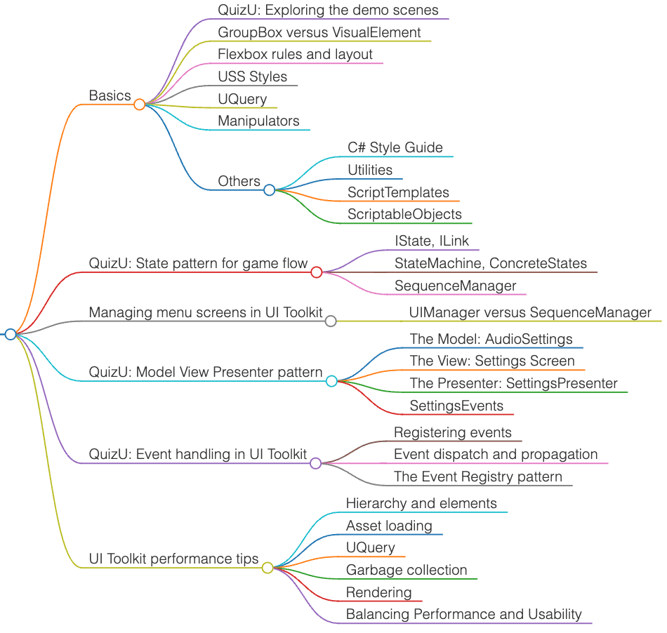

# Unity UI Toolkits - QuizU

<!-- TOC -->
* [Unity UI Toolkits - QuizU](#unity-ui-toolkits---quizu)
  * [Overview](#overview)
  * [Catalog](#catalog)
  * [Demos](#demos)
  * [The mini-game](#the-mini-game)
  * [Design patterns](#design-patterns)
    * [Event-driven development](#event-driven-development)
<!-- TOC -->

## Overview

- [Unity Asset Store: QuizU - A UI toolkit sample](https://assetstore.unity.com/packages/essentials/tutorial-projects/quizu-a-ui-toolkit-sample-268492#description)
  - Event dispatch and propagation
  - The state pattern for game flow
  - Managing menu screens in UI Toolkit
  - The model-view-presenter pattern in QuizU
  - Event handling in UI Toolkit 
- Tutorial: QuizU-documentation-Nov1-2023.pdf
- [Codebase: unity-tutorial-projects/QuizU](https://github.com/androchentw/unity-tutorial-projects/tree/main/QuizU)
- [UI Toolkit Examples](https://docs.unity3d.com/Manual/UIE-examples.html)

## Catalog

- Basics
  - QuizU: Exploring the demo scenes
  - GroupBox versus VisualElement
  - Flexbox rules and layout
  - USS Styles
  - UQuery
  - Manipulators
  - Others
    - C# Style Guide
    - Utilities
    - ScriptTemplates
    - ScriptableObjects
- QuizU: State pattern for game flow
  - IState, ILink
  - StateMachine, ConcreteStates
  - SequenceManager
- Managing menu screens in UI Toolkit
  - UIManager versus SequenceManager
- QuizU: Model View Presenter pattern
  - The Model: AudioSettings
  - The View: Settings Screen
  - The Presenter: SettingsPresenter
  - SettingsEvents
- QuizU: Event handling in UI Toolkit
  - Registering events
  - Event dispatch and propagation
  - The Event Registry pattern
- UI Toolkit performance tips
  - Hierarchy and elements
  - Asset loading
  - UQuery
  - Garbage collection
  - Rendering
  - Balancing Performance and Usability

## Demos

- [**UXML** and Visual Trees](https://docs.unity3d.com/Manual/UIE-VisualTree.html)
  - UXML (Unity XML) files form a hierarchical structure of UI elements
  - These visual trees serve as a blueprint for your user interface
  - 
- [**Flexbox**](https://docs.unity3d.com/Manual/UIE-LayoutEngine.html)
  - The Flexible Box Layout Model (flexbox) provides an efficient layout model for arranging UI elements dynamically within a container.
  - 
- [Unity Style Sheets (**USS**)](https://docs.unity3d.com/Manual/UIE-about-uss.html)
  - USS allows developers to customize UI elements with predefined styles. 
  - Re-skinning your UI is just a matter of swapping style sheets.
  - [USS transition](https://docs.unity3d.com/Manual/UIE-Transitions.html)
- [**UQuery**](https://docs.unity3d.com/Manual/UIE-UQuery.html)
  - UQuery simplifies the process of searching through a complex hierarchy of UI elements, enabling seamless navigation to specific UI components within the visual tree.
- [**Pseudo-classes**](https://docs.unity3d.com/Manual/UIE-USS-Selectors-Pseudo-Classes.html)
  - Pseudo-classes can be used to create interactive and animated UI elements with minimal extra code, adding extra 'juice' to your visual interface (e.g. enlarging a button when hovering over it or changing a text field color after selection). 
  - such as `:hover`, `:active`, and `:focus`
  - 
- [UI Toolkit **Event System**](https://docs.unity3d.com/Manual/UIE-Events-Dispatching.html)
  - UI Toolkit has its own complementing event system, designed to handle your UI's clicks, changes, and pointer input, even across complex hierarchies.
  - 
- [**Manipulators**](https://docs.unity3d.com/Manual/UIE-Events-Handling.html#manipulator)
  - Encapsulating related event callbacks into a single class, a manipulator promotes reusability and makes it easier to define user interactions (e.g. a click-and-drag manipulator for an inventory system, a gesture manipulator for a pinch-to-zoom effect, etc.).
- [**Custom Controls**](https://docs.unity3d.com/Manual/UIB-structuring-ui-custom-elements.html)
  - The demo shows how to define and instantiate custom VisualElement through UxmlFactory and UxmlTraits classes. These custom controls can then be reused through scripts or the UI Builder.
  - 

## The mini-game

- **UI Document**: `UIScreens.uxml`
- **Screen stack**: A stack-based state machine manages the UIs
  - Each screen is a **fullscreen UI** under the control of a `UIManager` class and is treated as a layer of a stack.
  - Think of it like working with a **pile of plates**: You can only interact with the top plate, and to get to a plate beneath the top one, you have to remove plates on top of it. The last plate you put on is always the first one you take off.
  - When a new screen opens, the UI Manager pushes onto the top of the stack and makes it the active state. When a screen is closed, it pops off the stack. This is a simple and effective way to navigate between modal screens.
- **Sub-screen**: The main Game Screen is a composite of several smaller displays 

## Design patterns

- Ref: [Design Patterns](../0-architecture-patterns/design-patterns/README.md)
- The **state pattern** allows an object to alter its behavior when its internal state changes. The QuizU project uses a `SequenceManager` and `UIManager` that show different types of state machines.
- The **model-view-presenter (MVP) pattern** maintains a strict separation between the app's data (Model), UI (View), and the controlling intermediary that binds the two (Presenter). 
- The **observer pattern** can help decouple objects to reduce their interdependencies. QuizU uses `System.Action` delegates as well as the `UI Toolkit event system`.

### Event-driven development

- Observer pattern reduce reliance on the singleton pattern
