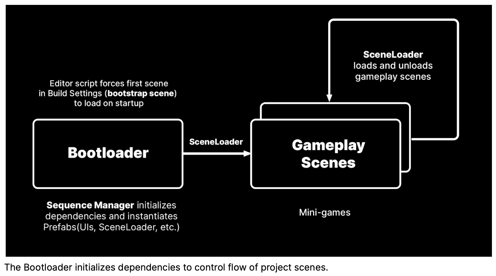

# Unity UI Toolkits - QuizU

<!-- TOC -->
* [Unity UI Toolkits - QuizU](#unity-ui-toolkits---quizu)
  * [Overview](#overview)
  * [Catalog](#catalog)
  * [Demos](#demos)
  * [The mini-game](#the-mini-game)
  * [Design patterns](#design-patterns)
    * [Event-driven development](#event-driven-development)
    * [BootloadScreen](#bootloadscreen)
    * [Utilities](#utilities)
    * [Others](#others)
    * [ScriptableObjects](#scriptableobjects)
  * [QuizU: State pattern for game flow](#quizu-state-pattern-for-game-flow)
    * [Game states](#game-states)
  * [Managing menu screens in UI Toolkit](#managing-menu-screens-in-ui-toolkit)
    * [Screen stack navigation](#screen-stack-navigation)
    * [GameScreen example: Controlling other UIs](#gamescreen-example-controlling-other-uis)
  * [QuizU: Model View Presenter pattern](#quizu-model-view-presenter-pattern)
  * [QuizU: Event handling in UI Toolkit](#quizu-event-handling-in-ui-toolkit)
    * [Registering events](#registering-events)
    * [Event dispatch and propagation](#event-dispatch-and-propagation)
    * [Event Registry pattern](#event-registry-pattern)
  * [UI Toolkit performance tips](#ui-toolkit-performance-tips)
<!-- TOC -->

## Overview

- [Unity Asset Store: QuizU - A UI toolkit sample](https://assetstore.unity.com/packages/essentials/tutorial-projects/quizu-a-ui-toolkit-sample-268492#description)
  - Event dispatch and propagation
  - The state pattern for game flow
  - Managing menu screens in UI Toolkit
  - The model-view-presenter pattern in QuizU
  - Event handling in UI Toolkit
- Tutorial: [QuizU-documentation-Nov1-2023.pdf](https://github.com/androchentw/unity-tutorial-projects/blob/main/QuizU/Assets/Unity%20Technologies/QuizU-documentation-Nov1-2023.pdf)
- [Codebase: unity-tutorial-projects/QuizU](https://github.com/androchentw/unity-tutorial-projects/tree/main/QuizU)
- [UI Toolkit Examples](https://docs.unity3d.com/Manual/UIE-examples.html)

## Catalog

## Demos

- [**UXML** and Visual Trees](https://docs.unity3d.com/Manual/UIE-VisualTree.html)
  - UXML (Unity XML) files form a hierarchical structure of UI elements
  - These visual trees serve as a blueprint for your user interface
  - 
- [**Flexbox**](https://docs.unity3d.com/Manual/UIE-LayoutEngine.html)
  - The Flexible Box Layout Model (flexbox) provides an efficient layout model for arranging UI elements dynamically within a container.
  - 
- [Unity Style Sheets (**USS**)](https://docs.unity3d.com/Manual/UIE-about-uss.html)
  - USS allows developers to customize UI elements with predefined styles.
  - Re-skinning your UI is just a matter of swapping style sheets.
  - [USS transition](https://docs.unity3d.com/Manual/UIE-Transitions.html)
- [**UQuery**](https://docs.unity3d.com/Manual/UIE-UQuery.html)
  - UQuery simplifies the process of searching through a complex hierarchy of UI elements, enabling seamless navigation to specific UI components within the visual tree.
- [**Pseudo-classes**](https://docs.unity3d.com/Manual/UIE-USS-Selectors-Pseudo-Classes.html)
  - Pseudo-classes can be used to create interactive and animated UI elements with minimal extra code, adding extra 'juice' to your visual interface (e.g. enlarging a button when hovering over it or changing a text field color after selection).
  - such as `:hover`, `:active`, and `:focus`
  - 
- [UI Toolkit **Event System**](https://docs.unity3d.com/Manual/UIE-Events-Dispatching.html)
  - UI Toolkit has its own complementing event system, designed to handle your UI's clicks, changes, and pointer input, even across complex hierarchies.
  - 
- [**Manipulators**](https://docs.unity3d.com/Manual/UIE-Events-Handling.html#manipulator)
  - Encapsulating related event callbacks into a single class, a manipulator promotes reusability and makes it easier to define user interactions (e.g. a click-and-drag manipulator for an inventory system, a gesture manipulator for a pinch-to-zoom effect, etc.).
- [**Custom Controls**](https://docs.unity3d.com/Manual/UIB-structuring-ui-custom-elements.html)
  - The demo shows how to define and instantiate custom VisualElement through UxmlFactory and UxmlTraits classes. These custom controls can then be reused through scripts or the UI Builder.
  - 

## The mini-game

- **UI Document**: `UIScreens.uxml`
- **Screen stack**: A stack-based state machine manages the UIs
  - Each screen is a **fullscreen UI** under the control of a `UIManager` class and is treated as a layer of a stack.
  - Think of it like working with a **pile of plates**: You can only interact with the top plate, and to get to a plate beneath the top one, you have to remove plates on top of it. The last plate you put on is always the first one you take off.
  - When a new screen opens, the UI Manager pushes onto the top of the stack and makes it the active state. When a screen is closed, it pops off the stack. This is a simple and effective way to navigate between modal screens.
- **Sub-screen**: The main Game Screen is a composite of several smaller displays

## Design patterns

- Ref: [Design Patterns](../0-architecture-patterns/design-patterns/README.md)
- The **state pattern** allows an object to alter its behavior when its internal state changes. The QuizU project uses a `SequenceManager` and `UIManager` that show different types of state machines.
- The **model-view-presenter (MVP) pattern** maintains a strict separation between the app's data (Model), UI (View), and the controlling intermediary that binds the two (Presenter).
- The **observer pattern** can help decouple objects to reduce their interdependencies. QuizU uses `System.Action` delegates as well as the `UI Toolkit event system`.

### Event-driven development

- Observer pattern reduces reliance on the singleton pattern
- **Game Events** (`\Quiz\Scripts\Events\GameEvents.cs`)
  - These events manage the core game flow
  - They update questions, handle user-selected answers, display feedback, and manage game states (start, pause, abort, win, lose).
- **Level Selection Events** (`\Quiz\Scripts\Events\LevelSelectionEvents.cs`)
  - These events allow the user to choose a quiz from the Level Selection Screen
- **Scene Events** (`\Quiz\Scripts\Events\SceneEvents.cs`)
  - These events manage loading, unloading, and progress updates of different scenes in the game
- **Settings Events** (`\Quiz\Scripts\Events\SettingsEvents.cs`)
  - These events handle changes to master, SFX, and music volume
- **UIToolkit Events** (`Quiz\Scripts\Events\UIEvents.cs` `)
  - UI Toolkit maintains a separate set of events to interact with UI elements, such as buttons, sliders, and input fields.
  - They process everything from clicks and drag to value changes, and can be used to trigger updates or transitions in the game.

### BootloadScreen

- `Scripts/Editor/SceneBootstrapper.cs`
  - https://github.com/Unity-Technologies/com.unity.multiplayer.samples.coop/blob/main/Assets/Scripts/Editor/SceneBootstrapper.cs
  - This class auto-loads a bootstrap screen (first scene in Build Settings) while working in the Editor.
  - It also adds menu items to toggle behavior.
- `Scripts/Managers/SequenceManager.cs: MonoBehaviour`
  - A SequenceManager controls the overall flow of the application using a state machine.
  - Use this class to define how each State will transition to the next. Each state can transition to the next state when receiving an event or reaching a specific condition.
- `Scripts/Utilities/SceneLoader.cs: MonoBehaviour`
  - Use this basic helper for loading scenes by name, index, etc.
- `Scripts/UI/Screens/BootloadScreen.cs: MonoBehaviour`
  - This class controls the display of the BootloaderScreen. This screen appears only briefly before pressing Play so it uses an ExecuteInEditMode attribute.
- Gameplay Scenes

### Utilities

`\Quiz\Scripts\Utilities`

- **EventRegistry**
  - This utility class manages the registration and unregistration of UI Toolkit events. Because so much of the game flow hinges on setting up events, the EventRegistry makes that process easier. See Event handling in UI Toolkit for more information.
- **Coroutines**
  - This helper class provides static methods for managing coroutines. This can help a System.Object or ScriptableObject run a coroutine on a separate MonoBehaviour.
- **DestroyOnLoad**
  - Apply this to temporary objects to remove them during the scene load process.
- **NullRefChecker**
  - If you are using the Inspector to set required dependencies, use this to validate your fields. Bypass this behavior using the custom Optional attribute.
- **Tooltip**
  - This shows how to use a UI Toolkit Manipulator to make a simple tooltip that stays within the boundaries of the screen.

### Others

- [Unity E-book: Create a C# style guide: Write cleaner code that scales](https://unity.com/resources/create-code-c-sharp-style-guide-e-book)
- ScriptTemplates

### ScriptableObjects

- Ref: [6-unity-data-management.md](6-unity-data-management.md)

## QuizU: State pattern for game flow

- IState, ILink
- StateMachine, ConcreteStates
- SequenceManager

### Game states

## Managing menu screens in UI Toolkit

### Screen stack navigation

- UIManager versus SequenceManager
- `UIScreen.cs`
- `UIManager.cs`

### GameScreen example: Controlling other UIs

## QuizU: Model View Presenter pattern

- The Model: AudioSettings
  - `QuizU\Assets\Quiz\Scripts\ScriptableObjects\AudioSettingsSO.cs`
- The View: Settings Screen
- The Presenter: SettingsPresenter
- `static SettingsEvents.cs`

## QuizU: Event handling in UI Toolkit

### Registering events

- Alternate callback syntax
- Unregistering events

### Event dispatch and propagation

### Event Registry pattern

- `EventRegistry : IDisposable`
- Using the Event Registry
- Extending the Registry

## UI Toolkit performance tips

- Hierarchy and elements
- Asset loading
  - Check texture memory in the Profiler.
- UQuery
- Garbage collection
  - Enabling Incremental Garbage Collection can help reduce memory pressure.
- Rendering
- Styles and selectors
  - USS selector cheat sheet (avoid the * selector).
  - 
- Balancing Performance and Usability
  - Be aware of complex hierarchies when using the :hover pseudo-state
  - Use simple hierarchies when possible.