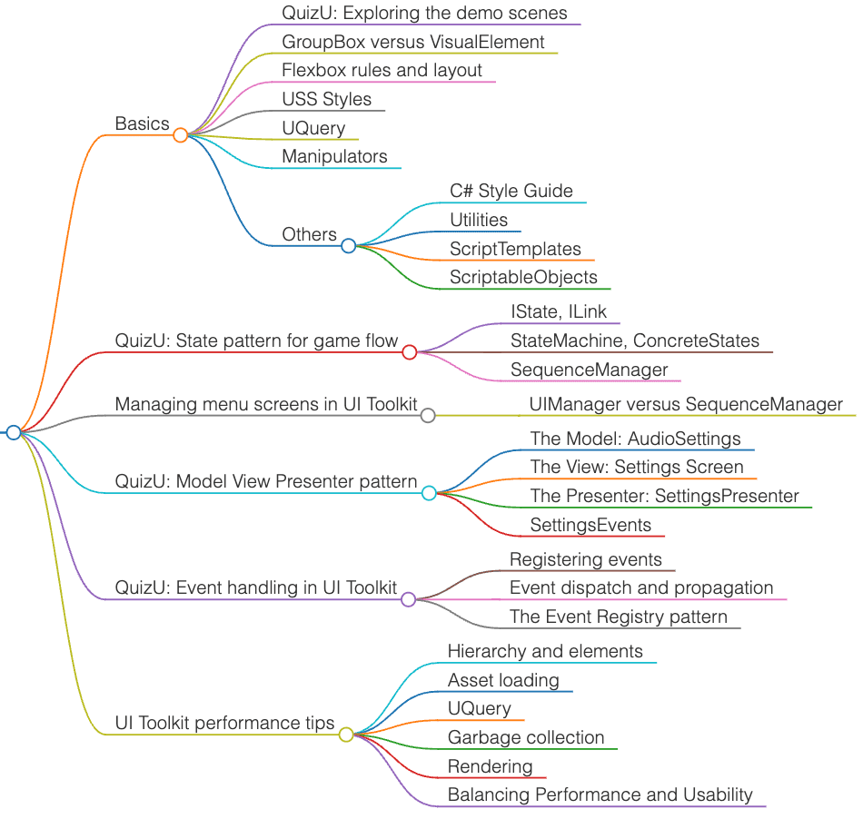

# Unity UI Toolkits

<!-- TOC -->
* [Unity UI Toolkits](#unity-ui-toolkits)
  * [Tutorials](#tutorials)
  * [QuizU - A UI toolkit sample](#quizu---a-ui-toolkit-sample)
    * [Tutorial: QuizU-documentation-Nov1-2023.pdf](#tutorial-quizu-documentation-nov1-2023pdf)
      * [Catalog](#catalog)
  * [UI Toolkit sample – Dragon Crashers](#ui-toolkit-sample--dragon-crashers)
  * [阿嚴 YouTube 教學](#阿嚴-youtube-教學)
    * [新功能](#新功能)
    * [UI Toolkit基礎教程](#ui-toolkit基礎教程)
    * [數據驅動基礎教程](#數據驅動基礎教程)
  * [其他](#其他)
<!-- TOC -->

## Tutorials

- [Ebook - User interface design and implementation in Unity](https://unity.com/resources/user-interface-design-and-implementation-in-unity)
- [UI Toolkit Manual](https://docs.unity3d.com/6000.0/Documentation/Manual/UIElements.html)
- [Using Unity UI Toolkit](https://www.youtube.com/watch?v=pqSwaqJmYwk&list=PL5domiITryHhlCKPSpiGuUt_kQg0nk3Of&index=5)

## QuizU - A UI toolkit sample

- [Unity Asset Store: QuizU - A UI toolkit sample](https://assetstore.unity.com/packages/essentials/tutorial-projects/quizu-a-ui-toolkit-sample-268492#description)
  - Event dispatch and propagation
  - The state pattern for game flow
  - Managing menu screens in UI Toolkit
  - The model-view-presenter pattern in QuizU
  - Event handling in UI Toolkit

### Tutorial: QuizU-documentation-Nov1-2023.pdf

#### Catalog

- Basics
  - QuizU: Exploring the demo scenes
  - GroupBox versus VisualElement
  - Flexbox rules and layout
  - USS Styles
  - UQuery
  - Manipulators
  - Others
    - C# Style Guide
    - Utilities
    - ScriptTemplates
    - ScriptableObjects
- QuizU: State pattern for game flow
  - IState, ILink
  - StateMachine, ConcreteStates
  - SequenceManager
- Managing menu screens in UI Toolkit
  - UIManager versus SequenceManager
- QuizU: Model View Presenter pattern
  - The Model: AudioSettings
  - The View: Settings Screen
  - The Presenter: SettingsPresenter
  - SettingsEvents
- QuizU: Event handling in UI Toolkit
  - Registering events
  - Event dispatch and propagation
  - The Event Registry pattern
- UI Toolkit performance tips
  - Hierarchy and elements
  - Asset loading
  - UQuery
  - Garbage collection
  - Rendering
  - Balancing Performance and Usability

## UI Toolkit sample – Dragon Crashers

- [Unity Asset Store: UI Toolkit sample – Dragon Crashers](https://assetstore.unity.com/packages/essentials/tutorial-projects/dragon-crashers-ui-toolkit-sample-project-231178)

## 阿嚴 YouTube 教學

### 新功能

- [Unity UI 工具包 新功能教程](https://ryanxudev.github.io/#tutorials)
  - [第一部分](https://www.youtube.com/watch?v=cbQJq_O3ZEo) - 在 UI 构建器里绑定数据 (推薦 綁定 SO)
    - Inspector > Data Source > ScriptableObject > Add Binding > Data Source Path
  - [第二部分](https://www.youtube.com/watch?v=eBda493MQHo) - 另外两种数据绑定方式
    - `[CreateProperty] string CharacterLevelString => $"Level: {characterLevel}";`; `[DontCreateProperty]` 減少錯誤標示
    - [BindingMode](https://docs.unity3d.com/6000.0/Documentation/Manual/UIE-runtime-binding-mode-update.html)
      - TwoWay: 洗點. UI data 互相影響
      - ToSource: UI 改 data. 如 音量滑動條
      - ToTarget: 最常用. 當 data 有變動時, 單向改變 UI 顯示
      - ToTargetOnce: UI 只更新一次. 如成就 UI
    - 第二種方法: 直接改 UXML (效果同 Unity 操作)
    - 第三種方法: 用 C# 寫 data binding. 比較複雜/靈活需要彈性時. runtime 才會顯示
  - [第三部分](https://www.youtube.com/watch?v=Z9AVTt4zZck) - 更简便地创建自定义控件
    - 自訂血條

### UI Toolkit基礎教程

- [Script template](https://www.youtube.com/watch?v=uh9bDTX9T5E)
  - UnityInstallPath/Editor/Data/Resources/ScriptTemplates/*.txt
  - Assets > ScriptTemplates
- [UI Toolkit基礎教程 Part 1 | 如何使用UI Toolkit | UI工具包 | JRPG 教程項目前置](https://www.youtube.com/watch?v=CfQL0cI-zPc)
  - UI Toolkit > UGUI: [各有擅場](https://docs.unity3d.com/2022.2/Documentation/Manual/UIElements.html)
  - UGUI: GameObject based, prefab workflow
  - Window > UIToolkit > UI Builder or Assets > Data > UIDocuments > UXML(Content), USS(Style), Behavior(C#)
  - Screen Overlay UI: 像是手機/網頁 box model (FlexBox)
- [Part 2 | UI的布局和樣式](https://www.youtube.com/watch?v=wZP47DZcAzM)
  - Layout, Container(Panel); Flex basis (25%) / grow (1), background, border, Margin/Padding, Text
- 配色: [FlatColors](https://flatuicolors.com/), [Colors](https://coolors.co/palettes/trending)
- [Part 3 | 為什麽我們應該學習並使用UI Toolkit](https://www.youtube.com/watch?v=PimLImYQFz0)
  - Panel: sort order, scale mode, reference resolution; source asset => UXML
  - Data binding: `getComponent<UIDocument>().rootVisualElement`
  - 高性能, 高適用性

### 數據驅動基礎教程

- [UI Toolkit - UQuery | 如何查找UI元素 | 數據驅動基礎教程 Part 1](https://www.youtube.com/watch?v=DOn8P5Fg0gg)
  - 找所有: `rootVisualElement.Query<Label>("").ForEach(object => object.text = "name")`
  - 找第一個: `rootVisualElement.Q<Label>("").ForEach(object => object.text = "name")`
  - Texture2D
- [UI Toolkit - Custom Controls | 自定義UI元素 | 角色數據類 | 數據驅動基礎教程 Part 2](https://www.youtube.com/watch?v=a0EbiuDE3nI)
- [UI Toolkit - Data Binding | 数据驱动基础教程 Part 3](https://www.youtube.com/watch?v=SRqwuwc_o0E)
- [使用Excel等製表工具簡化數據輸入 | 數據驅動基礎教程 Part 4](https://www.youtube.com/watch?v=b90awFcUJ60)
- [數據輸出 | UI Toolkit Manipulator & Events System | 數據驅動基礎教程 Part 5](https://www.youtube.com/watch?v=11zqHk6kbhE)

## 其他

- [使用Rule Tiles（规则瓦片）快速创建游戏场景](https://www.youtube.com/watch?v=LWTjXPBJ1Us)
