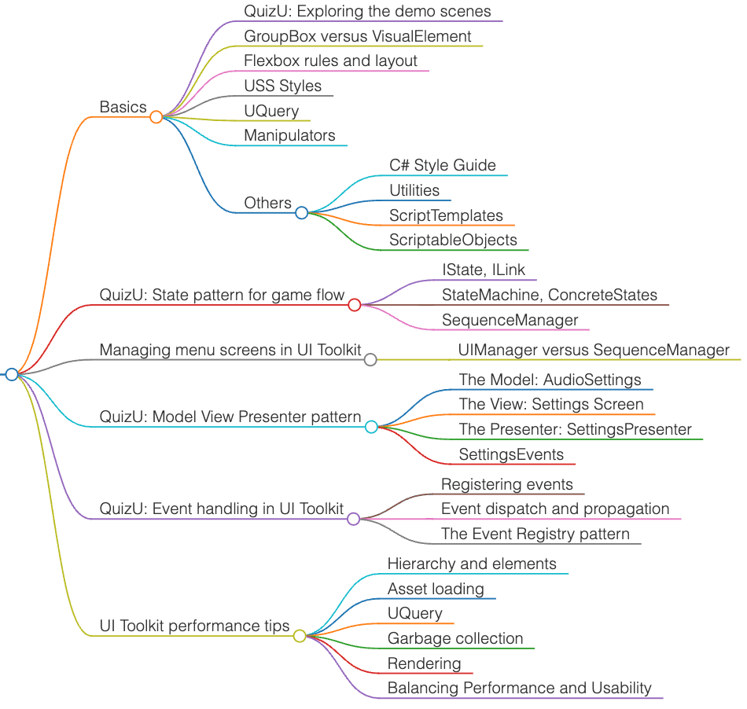

# Unity Playground


<div style="text-align: center;">
  
  <br/>
  <sub><sup>Photo by <a href="https://unsplash.com/@androchentw?utm_content=creditCopyText&utm_medium=referral&utm_source=unsplash">Andro Chen</a> on <a href="https://unsplash.com/photos/av_vGjHnK-g?utm_content=creditCopyText&utm_medium=referral&utm_source=unsplash">Unsplash</a>
  </sup></sub>
</div>

## Overview

<!-- TOC -->
* [Unity Playground](#unity-playground)
  * [Overview](#overview)
  * [Project Structure Template](#project-structure-template)
  * [Design Patterns](#design-patterns)
  * [Unity Lifecycle](#unity-lifecycle-)
  * [Contribute](#contribute)
<!-- TOC -->

```text
unity-playground/
├── 0-architecture-patterns/
│   ├── design-patterns/
│   │   ├── design-patterns-cs/
│   │   ├── Tutorial-Lessons.md
│   │   ├── Tutorial-Samples-Basic.md
│   │   ├── Tutorial-Samples-More.md
│   ├── Clean-Architecture.md
│   ├── DDD-Domain-Driven-Design.md
│   ├── MVC-MVP-MVVM.md
│   └── UML.md
├── 1-unity-basics/
│   ├── 1-unity-jetbrains-rider.md
│   ├── 2-unity-basics.md
│   ├── 3-unity-folder-structure.md
│   ├── 4-unity-best-practices.md
│   ├── 5-unity-ui-toolkits.md
│   ├── 5-unity-ui-toolkits-QuizU.md
│   ├── 6-unity-data-management.md
│   ├── 6-unity-scriptable-object.md
│   ├── 7-unity-custom-package.md
│   ├── 8-unity-localization.md
│   ├── 9-unity-input-system.md
│   └── TimerController.cs
├── 2-unity-assets-collection/
│   ├── 1-unity-assets-tools.md
│   ├── 2-unity-assets-templates.md
│   ├── 3-unity-assets-gui.md
│   └── 4-unity-assets-audio.md
├── 3-unity-advanced/
│   ├── unity-addressable.md
│   ├── unity-others.md
│   └── unity-web-request.md
```

## Project Structure Template

- [UnityBaseTemplate2DURP](https://github.com/androchentw/UnityBaseTemplate2DURP): A 2D URP Unity template to start with
- Others
  - [unity-best-practices](https://github.com/androchentw/unity-best-practices/tree/andro): Unity Best Practices for C# Design Patterns.
  - [unity-project-template](https://github.com/androchentw/unity-project-template/tree/andro): clean project structure and C# coding standards template
  - [rmc-mini-mvcs](https://github.com/androchentw/rmc-mini-mvcs/tree/andro/docs): MVCS architecture example and design
    patterns explained




## Design Patterns


## Unity Lifecycle 

- [Unity Script lifecycle overview](https://docs.unity3d.com/Manual/execution-order.html)


## Contribute

* [LICENSE](LICENSE)
* [CODE_OF_CONDUCT](CODE_OF_CONDUCT.md)
* [CONTRIBUTING](CONTRIBUTING.md)

<a href="https://github.com/an/template-playground/graphs/contributors">
  
</a>

<!-- Links -->
