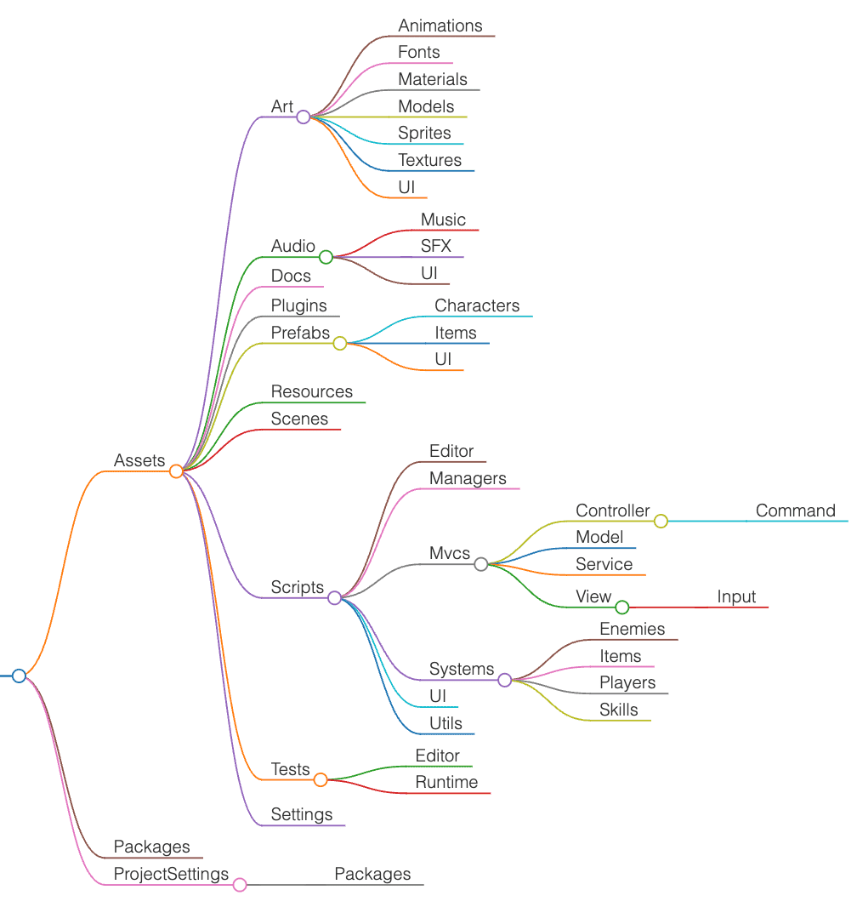
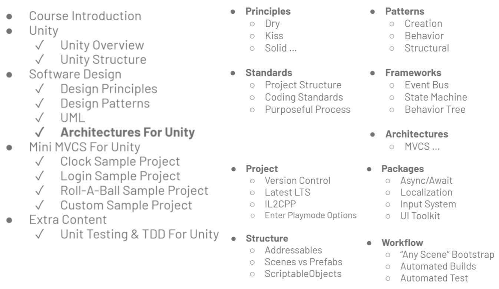

# Unity Best Practices

<!-- TOC -->
* [Unity Best Practices](#unity-best-practices)
  * [C# General](#c-general)
  * [Code Style Guide](#code-style-guide)
  * [Unity Folder Structure](#unity-folder-structure)
    * [Sample Project Structure](#sample-project-structure)
    * [Reference Structure - unity-project-template](#reference-structure---unity-project-template)
  * [MVCS (Model-View-Controller-Service)](#mvcs-model-view-controller-service)
  * [Design Patterns](#design-patterns)
  * [DI (Dependency Injection), IoC C# unity](#di-dependency-injection-ioc-c-unity)
  * [Mobile Game Design](#mobile-game-design)
  * [LiveOps](#liveops)
<!-- TOC -->

## C# General

- [Day15 物件導向封裝性-Get & Set 存取器](https://ithelp.ithome.com.tw/articles/10223760)
- [Unity C# | Tag和Layer差異與特性 & 抓取Tag物件](https://vocus.cc/article/6203a9b8fd897800014ad1dd)
  - `GameObject respawn = GameObject.FindWithTag("...");`
  - `GameObject [] respawns = GameObject.FindGameObjectsWithTag("...");`

## Code Style Guide

- [C# Coding Standards and Naming Conventions](https://github.com/ktaranov/naming-convention/blob/master/C%23%20Coding%20Standards%20and%20Naming%20Conventions.md)
  - 幾乎都是 PascalCase
  - 除了 localVar 或 _privateVar
- [Create a C# style guide: Write cleaner code that scales](https://unity.com/resources/create-code-c-sharp-style-guide-e-book?ungated=true)
- [Unity C# | 命名法則 & 低耦合、高內聚](https://vocus.cc/designer/61fe9831fd897800014eedda)
- [Unity-Code-Style-Guide](https://github.com/androchentw/Unity-Code-Style-Guide)
- [Formatting best practices for C# scripting in Unity](https://unity.com/how-to/formatting-best-practices-c-scripting-unity)
- [Unity Coding guidelines & Basic Best Practices](https://avangarde-software.com/unity-coding-guidelines-basic-best-practices/)

## Unity Folder Structure

- [Best practices for organizing your Unity project](https://unity.com/how-to/organizing-your-project)
- [unity-project-template](https://github.com/androchentw/unity-project-template/tree/andro): clean project structure and C# coding standards template
- [unity-project-style-guide](https://github.com/timdhoffmann/unity-project-style-guide)
- [Adding tests to a package](https://docs.unity3d.com/Manual/cus-tests.html)
- [How to run automated tests for your games with the Unity Test Framework](https://unity.com/how-to/automated-tests-unity-test-framework)

Note: ignored `*.meta`, `*.asset`

### Sample Project Structure



- Assets
  - Art
    - Animations
    - Fonts
    - Materials
    - Models
    - Sprites
    - Textures
    - UI
  - Audio
    - Music
    - SFX
    - UI
  - Docs
  - Plugins
  - Prefabs
    - Characters
    - Items
    - UI
  - Resources
  - Scenes
  - Scripts
    - Editor
    - Managers
    - Mvcs
      - Controller
        - Command
      - Model
      - Service
      - View
        - Input
    - Systems
      - Enemies
      - Items
      - Players
      - Skills
    - UI
    - Utils
  - Tests
    - Editor
    - Runtime
  - Settings
- Packages
- ProjectSettings
  - Packages

### Reference Structure - unity-project-template

```text
UnityProject/
├── Assets/
    ├── 3rdParty/
        ├── [CompanyName]/
            ├── [PackageName]/
                ├── Version.txt
    ├── Art/
        ├── Animation/
            ├── AnimationClips/
            ├── Animators/
        ├── Audio/
            ├── AudioClips/
            ├── AudioMixers/
        ├── Fonts/
            ├── Arial.ttf
        ├── Materials/
            ├── FloorMaterial.mat
            ├── PlayerMaterial.mat
        ├── Models/
        ├── Shaders/
        ├── Sprites/
        ├── Textures/
            ├── FloorTexture.png
    ├── Documentation/
        ├── Images/
            ├── BestPractices.png
        ├── ReadMe/
            ├── Art/
                ├── Sprites/
                    ├── ProjectIcon.png
            ├── Scripts/
                ├── Editor/
                    ├── ReadMeMenuItems.cs
    ├── Prefabs/
        ├── [MyCompany]/
            ├── [MyProject]/
                ├── AudioManager.prefab
    ├── Resources/
        ├── [MyCompany]/
            ├── [MyProject]/
    ├── Scenes/
        ├── Scene01_Intro.unity
    ├── Scripts/
        ├── Editor/
            ├── [MyCompany]/
                ├── Templates/
                    ├── TemplateEditorMenuItems.cs
                ├── [MyProject]/
        ├── Runtime/
            ├── [MyCompany]/
                ├── Templates/
                    ├── ITemplateInterface.cs
                    ├── TemplateClass.cs
                    ├── TemplateComponent.cs
                    ├── TemplateScriptableObject.cs
                ├── [MyProject]/
                    ├── Scenes/
                        ├── Scene01_Intro.cs
                    ├── UI/
                        ├── HudUI.cs
        ├── Tests/
            ├── Editor/
                ├── [MyCompany]/
                    ├── Templates/
                        ├── TemplateClassEditModeTest.cs
                    ├── [MyProject]/
            ├── Runtime/
                ├── [MyCompany]/
                    ├── Templates/
                        ├── TemplateComponentPlayModeTest.cs
                    ├── [MyProject]/
    ├── Settings/
        ├── Audio/
        ├── InputSystem/
        ├── PhysicMaterials/
        ├── Presets/
        ├── ProBuilder/
        ├── Rendering/
        ├── UIToolkit/
            ├── Layouts/
                ├── TemplateLayout.uxml
            ├── Resources/
            ├── Settings/
            ├── Styles/
                ├── TemplateStyles.uss
            ├── Themes/
                ├── TemplateThemeStyleSheet.tss
├── Packages/
    ├── manifest.json
    └── packages-lock.json
├── ProjectSettings/
```

## MVCS (Model-View-Controller-Service)

- [rmc-mini-mvcs](https://github.com/androchentw/rmc-mini-mvcs/tree/andro/docs): MVCS architecture example and design
  patterns explained
  - 
  - 
- [unity-best-practices](https://github.com/androchentw/unity-best-practices/tree/andro)
- Tips
  - Project Settings > Editor >Enter Play Mode Options = True
  - "Any Scene" Bootstrap: developer mode / testing
- https://ithelp.ithome.com.tw/articles/10222311

Credit: [Samuel Asher Rivello. Best Practices - 4 - Unity Case Study](https://www.youtube.com/watch?v=Y5uaw4mYR_E&list=PL5domiITryHiP04FA13aCM9pl4S_c9XOi&index=6)




## Design Patterns

- [C# Design Patterns](https://www.dofactory.com/net/design-patterns)
- [Design Pattern in C# explained by ChatGPT | 2024-10-26](https://chatgpt.com/share/671c90d8-7664-800f-b67e-8bec77698012)
- [game-programming-patterns-demo](https://github.com/androchentw/game-programming-patterns-demo)
- [Game Programming Patterns](https://gameprogrammingpatterns.com/contents.html)

## DI (Dependency Injection), IoC C# unity

- [Unity 維護靈藥：Dependency Injection](https://medium.com/akatsuki-taiwan-technology/unity%E7%B6%AD%E8%AD%B7%E9%9D%88%E8%97%A5-dependency-injection-6ba93fc6d629)
- [Dependency Injection in Unity C#](https://medium.com/@ssmore101/dependency-injection-in-unity-c-f32568a2109a)
- [Dependency Injection in Unity - Inversion of Control Container](https://discussions.unity.com/t/dependency-injection-in-unity-inversion-of-control-container/914827/2)
- [Zenject](https://github.com/modesttree/Zenject): [Extenject Dependency Injection IOC](https://assetstore.unity.com/packages/tools/utilities/extenject-dependency-injection-ioc-157735)

## Mobile Game Design

- [Mobile game design with Unity](https://unity.com/topics/mobile-game-design)
- [Optimize your game performance for mobile, XR, and the web in Unity](https://unity.com/resources/mobile-xr-web-game-performance-optimization-unity-6)
  - [GenAI NoteBook LLM Summary](https://notebooklm.google.com/notebook/10e53e23-00fa-49ee-bff4-b27ee0ccf4e7)
- [Introduction to game level design](https://unity.com/resources/introduction-to-level-design-in-game-development-and-in-unity)
- [The Unity Game Designer Playbook](https://unity.com/resources/game-designer-playbook)
- [Unity best practices](https://unity.com/how-to)
- [2D game art, animation, and lighting for artists](https://unity.com/resources/2d-game-art-animation-lighting-for-artists-ebook?isGated=false)
- [Best practices for managing elements](https://docs.unity3d.com/Manual/UIE-best-practices-for-managing-elements.html)

## LiveOps

- [From DevOps to LiveOps in one platform](https://unity.com/solutions/gaming-services)
  - Build your foundation: Accounts, Multiplayer, Content management, DevOps
  - Engage your players: Analytics, Player engagement, Community, Crash reporting
  - Grow your game: Monetization, User acquisition, Ad mediation, Publishing, Game economy
- [Use LiveOps to get the insights you need for a better player experience](https://unity.com/solutions/gaming-services/player-insights)
- [Power-up your live ops strategy for better player retention](https://unity.com/solutions/gaming-services/continuous-game-improvements)
- [IndieXP: Making the Most of Launch](https://create.unity.com/making-the-most-of-launch)
- [Indie XP: Building a live service and measuring success](https://create.unity.com/how-to-turn-your-mobile-game-into-a-successful-business)
- [5 best practices for maximizing long-term player value with Unity Analytics](https://unity.com/how-to/maximizing-long-term-player-value-unity-analytics)
- [使用 Unity 遊戲服務來開發多人與營運型遊戲 | 2022 TGDF 台北遊戲開發者論壇](https://hackmd.io/@samuel-t-chou/2022-TGDF/%2Fs%2FTeBfn7ePQISPDBHNXxnDjA)
